<!-- ============================================================ -->
<!-- 🎬 ANIMATED HEADER BANNER — self-hosted SVG -->
<!-- ============================================================ -->
<p align="center">
  <a href="https://github.com/hardik563">
    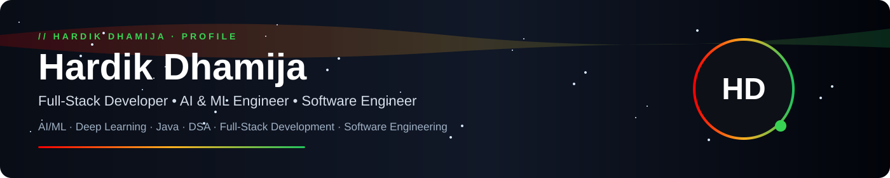
  </a>
</p>

<!-- 🐙 PROFESSIONAL GITHUB IDENTIFIER — pulsing brand-red halo + Invertocat -->
<p align="center">
  <a href="https://github.com/hardik563" aria-label="GitHub profile">
    
  </a>
</p>

<p align="center">
  <a href="https://github.com/hardik563">
    
  </a>
</p>

<p align="center">
  
</p>

<!-- 🪄 TYPING SVG — 31 rotating headlines (EN · DE · ar), JetBrains Mono -->
<div align="center">
  
</div>

<!-- 🏷️ PROFESSIONAL BADGES — stats row -->
<p align="center">
  <a href="https://github.com/hardik563"></a>
  <a href="https://github.com/hardik563?tab=followers"></a>
  <a href="https://github.com/hardik563"></a>
</p>

<!-- 🏷️ PROFESSIONAL BADGES — contact / profile row -->
<p align="center">
  <a href="https://www.linkedin.com/in/hardik-dhamija-35932228b/"></a>
  <a href="https://leetcode.com/u/hardikdhamija_/"></a>
  <a href="https://codolio.com/profile/hardikdhamija"></a>
  <a href="https://github.com/hardik563"></a>
</p>

<div align="center">
  
</div>

<!-- ============================================================ -->
<!-- 💻 ABOUT ME — animated cinematic hero card                    -->
<!-- ============================================================ -->
<h2 id="about" align="center">💻 About Me</h2>

<!-- 💬 Rotating motto ticker — 50 dev mottos cycling -->
<div align="center">
  
</div>

<!-- 🌟 Editorial hero banner — name, role, availability, stats -->
<p align="center">
  <a href="https://github.com/hardik563">
    
  </a>
</p>

<!-- 🎬 Personality break — Python coding GIF -->
<p align="center">
  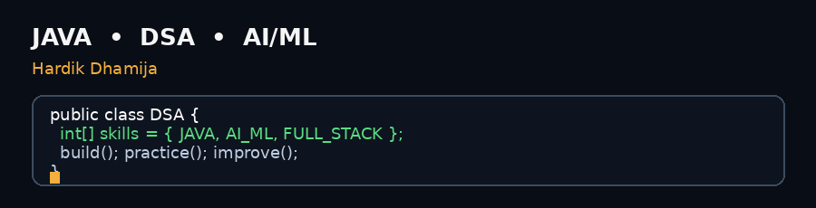
</p>

<!-- 📋 Full bio — Python class block, always visible -->

```python
class HardikDhamija:
    """B.Tech CSE (AI & ML) student building practical software projects."""

    education       = "B.Tech — Computer Science & Engineering (AI & ML)"
    location        = "🇮🇳 Lucknow, Uttar Pradesh, India"
    languages       = ["Java", "Python", "JavaScript", "C", "C++"]
    frontend        = ["HTML", "CSS", "JavaScript", "React"]
    cloud_devops    = ["AWS", "Azure", "Docker"]
    automation      = ["Selenium", "PyTest"]
    currently_into  = ["AI/ML", "Deep Learning", "Full-Stack Development", "DSA in Java", "Software Engineering"]
    projects        = ["CALLIVO", "TradeX", "Fake News Prediction"]
    achievements    = ["National-level Cricket", "State-level Chess", "Regional-level Carrom"]

    def philosophy(self) -> str:
        return "Learn → Build → Practice → Improve."

    def __repr__(self) -> str:
        return f"<{type(self).__name__} based_in={self.location!r}>"


me = HardikDhamija()
print(me.philosophy())  # → Learn → Build → Practice → Improve.
```

<!-- 🪐 Tech-orbit footer — animated technologies-circle, paired with the banner -->
<p align="center">
  <a href="https://github.com/hardik563">
    
  </a>
</p>


<!-- 💭 QUOTE OF THE DAY — auto-rotates daily by day-of-year -->
<!-- QUOTE:START -->
<p align="center">
  <i>"Java is to JavaScript what car is to carpet."</i><br/>
  <sub>— <b>Chris Heilmann</b></sub>
</p>
<!-- QUOTE:END -->

<div align="center">
  
</div>

<!-- TABLE OF CONTENTS -->
<h2 id="toc" align="center">🧭 Table of Contents</h2>

<p align="center">
  <a href="#skills">Skills</a> •
  <a href="#focus">Current Focus</a> •
  <a href="#highlights">Yearly Highlights</a> •
  <a href="#stats">GitHub Stats</a> •
  <a href="#activity">Recent Activity</a> •
  <a href="#releases">Latest Releases</a> •
  <a href="#projects">Featured Projects</a> •
  <a href="#profiles">Profiles</a> •
  <a href="#contributions">Contribution Graph</a> •
  <a href="#connect">Connect</a> •
  <a href="#support">Support</a>
</p>

<!-- TECHNICAL EXPERTISE -->
<div align="center">
  
  <a href="https://github.com/hardik563">
    
  </a>
  
</div>

<h2 id="skills" align="center">💻 Tech Stack</h2>

<p align="center">
  <i>Production-grade tools for production-grade systems.</i>
</p>

<!-- 🌟 Hero icon row — clean 15×3 grid via perline=15. Celery & Socket.io
     are NOT in skillicons.dev's catalog, so they live only in the encyclopedia
     badges table below (under "🔄 Async & Messaging"). Don't try to add them
     back to this URL — they render as empty slots and break the grid. -->
<p align="center">
  <a href="https://github.com/hardik563">
    
  </a>
</p>

<!-- 🎨 Single rotating terminal line — color changes per text shown, Tech Stack header -->
<div align="center">
  
</div>

<br/>

<!-- 💎 Elite tech stack cards — single SVG, 6 glassmorphism cards in 3×2 grid
     with accent stripes, stats, and animated proficiency bars (Vercel/Linear aesthetic) -->
<a href="https://github.com/hardik563?tab=repositories">
  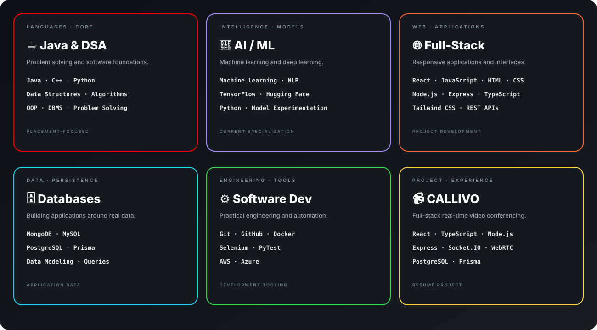
</a>

<br/><br/>

<!-- 🧠 NEURAL SKILL ATLAS
     ──────────────────────────────────────────────────────────────────────
     The brain SVG below is built from Wikimedia Commons' anatomically-
     accurate "Human-brain.SVG" by Hugh Guiney (CC-BY-SA-3.0), recolored
     with our neon palette via scripts/build_anatomical_brain.py.

     Regenerate (e.g., to tweak colors) with:
        python scripts/build_anatomical_brain.py
     ────────────────────────────────────────────────────────────────────── -->

<h3 align="center">🧠 Neural Skill Atlas</h3>

<p align="center">
  <sub><i>A living anatomical map of how my technical mind is organized — 200+ paths of real neuroanatomy, recolored with a neon palette and animated to pulse like a living brain.</i></sub>
</p>

<p align="center">
  
</p>

<p align="center">
  <a href="https://hardik563.github.io/hardik563/"></a>
  &nbsp;
  <a href="https://commons.wikimedia.org/wiki/File:Human-brain.SVG"></a>
</p>

<p align="center"><sub><i>🖱️ The interactive 3D version (above) extrudes every anatomical path into a 3D mesh with neon emissive shaders. Drag to rotate, scroll to zoom, right-drag to pan, auto-rotates when idle.</i></sub></p>

<details>
<summary align="center"><b>📦 More skills</b> — Paradigms · Operating Systems · Async · UI frameworks · Data Science · IDEs · APIs &amp; Security</summary>

<br/>

<table align="center" width="100%">
<tr>
<td align="center" width="33%" valign="top"><h4>🧠 Paradigms &amp; Architecture</h4><p>     </p></td>
<td align="center" width="33%" valign="top"><h4>🖥️ Operating Systems &amp; Shells</h4><p>    </p></td>
<td align="center" width="33%" valign="top"><h4>🔄 Async &amp; Messaging</h4><p>   </p></td>
</tr>
<tr>
<td align="center" width="33%" valign="top"><h4>🧩 UI Frameworks</h4><p>    </p></td>
<td align="center" width="33%" valign="top"><h4>📊 Data Science</h4><p>    </p></td>
<td align="center" width="33%" valign="top"><h4>🔧 IDEs &amp; Notebooks</h4><p>   </p></td>
</tr>
<tr>
<td align="center" width="33%" valign="top"><h4>🔐 APIs &amp; Security</h4><p>    </p></td>
<td align="center" width="33%" valign="top"><h4>🎨 Design &amp; Docs</h4><p>  </p></td>
<td align="center" width="33%" valign="top"><h4>☕ Core Languages</h4><p>   </p></td>
</tr>
<tr>
<td align="center" width="33%" valign="top"><h4>🟢 Backend Runtimes</h4><p> </p></td>
<td align="center" width="33%" valign="top"><h4>🗄️ Databases</h4><p>    </p></td>
<td align="center" width="33%" valign="top"><h4>☸️ Cloud Native</h4><p>  </p></td>
</tr>
</table>

</details>

<!-- CURRENT FOCUS -->
<div align="center">
  
  <a href="https://github.com/hardik563">
    
  </a>
  
</div>

<h2 id="focus" align="center">🎯 Current Focus</h2>

<p align="center">
  
</p>

<!-- YEARLY HIGHLIGHTS -->
<div align="center">
  
  <a href="https://github.com/hardik563">
    
  </a>
  
</div>

<h2 id="highlights" align="center">🚀 Yearly Highlights</h2>

<p align="center">
  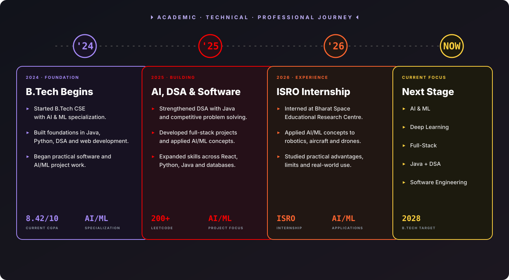
</p>

<!-- 📊 Live stats — auto-refreshed daily from GitHub GraphQL by readme.yml -->
<p align="center"><b>📊 This year, live from GitHub</b></p>

<!-- HIGHLIGHTS_STATS:START -->
<p align="center">   </p>
<!-- HIGHLIGHTS_STATS:END -->

<!-- The narrative bullets are still updated separately by you — kept as a marker
     so the text stays editable without rebuilding the SVG. -->
<!-- HIGHLIGHTS_CURRENT_YEAR:START -->
<p align="center"><i>Current-year highlights will be generated automatically.</i></p>
<!-- HIGHLIGHTS_CURRENT_YEAR:END -->

<!-- GITHUB STATS -->
<div align="center">
  
  <a href="https://github.com/hardik563">
    
  </a>
  
</div>

<h2 id="stats" align="center">📊 GitHub Stats</h2>

<div align="center">
  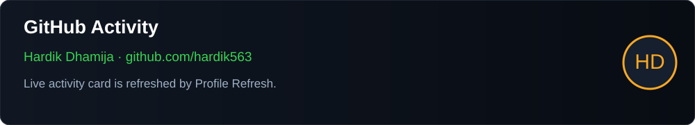
</div>

<div align="center">
  <a href="https://github.com/hardik563">
    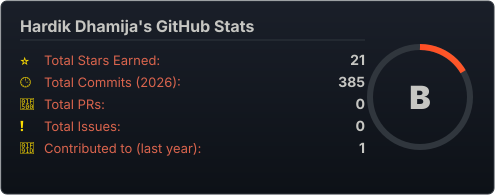
    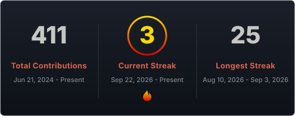
  </a>
</div>

<div align="center">
  <a href="https://github.com/hardik563">
    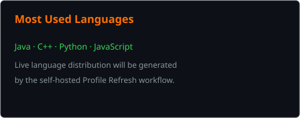
  </a>
</div>

</div>

<div align="center">
  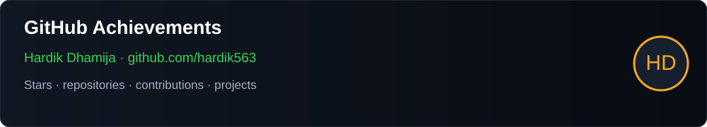
</div>

<div align="center">
  
</div>


<!--START_OF_CODE_STATS-->

<!--END_OF_CODE_STATS-->

<!-- RECENT ACTIVITY -->
<div align="center">
  
  <a href="https://github.com/hardik563">
    
  </a>
  
</div>

<h2 id="activity" align="center">⚡ Recent Activity</h2>

<!-- 🌳 GITGRAPH — Mermaid visualization of recent push events per repo -->
<h3 align="center">🌳 Branch Flow (last 7 days)</h3>

<!-- GITGRAPH:START -->
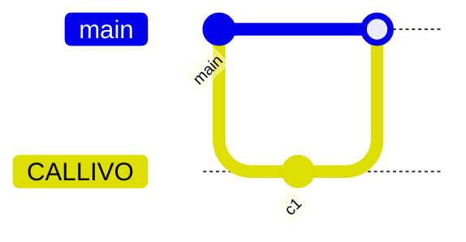
```mermaid
gitGraph
   commit id: "main"
   branch CALLIVO
   checkout CALLIVO
   commit id: "c1"
   checkout main
   merge CALLIVO
```
<!-- GITGRAPH:END -->

<h3 align="center">📜 Event Log</h3>

<!-- ACTIVITY:START -->
_No recent public activity._
<!-- ACTIVITY:END -->

<!-- LATEST RELEASES -->
<div align="center">
  
  <a href="https://github.com/hardik563">
    
  </a>
  
</div>

<h2 id="releases" align="center">📦 Latest Releases</h2>

<!-- LATEST_RELEASES:START -->
_No releases yet._
<!-- LATEST_RELEASES:END -->

<!-- FEATURED PROJECTS -->
<div align="center">
  
  <a href="https://github.com/hardik563">
    
  </a>
  
</div>

<h2 id="projects" align="center">🏗️ Featured Projects</h2>

<!-- ============================================================ -->
<!-- 🔥 AUTO-RANKED FEATURED PROJECTS — refreshed weekly by readme.yml -->
<!-- ============================================================ -->
<!-- FEATURED_PROJECTS:START -->
<p align="center"><i>Featured projects will be generated automatically from <b>hardik563</b> repositories after the first README workflow run.</i></p>
<!-- FEATURED_PROJECTS:END -->

<br/>

<details>
<summary align="center"><b>📖 Hand-written project cards</b> — Problem · Approach · Stack · Outcome</summary>

<br/>

<table width="100%">
  <tr>
    <td valign="top" width="50%">
      <h3>📹 CALLIVO — Full-Stack Video Conferencing</h3>
      <p><b>Project.</b> Real-time video conferencing application with audio/video communication, chat, screen sharing and participant management.<br/>
      <b>Stack.</b> <code>React.js · TypeScript · Node.js · Express.js · Socket.IO · WebRTC · PostgreSQL · Prisma</code></p>
    </td>
    <td valign="top" width="50%">
      <h3>📈 TradeX — Trading Platform Clone</h3>
      <p><b>Project.</b> Full-stack online stock brokerage platform inspired by Zerodha with authentication, order placement, portfolio tracking and transaction history.<br/>
      <b>Stack.</b> <code>HTML · CSS · JavaScript · Java · Node.js · MongoDB · Bootstrap</code></p>
    </td>
  </tr>
  <tr>
    <td valign="top" colspan="2">
      <h3>📰 Fake News Prediction — Machine Learning</h3>
      <p><b>Project.</b> Machine-learning project for classifying news content as fake or real as part of STTP project work.<br/>
      <b>Focus.</b> <code>Machine Learning · NLP · Python</code></p>
    </td>
  </tr>
</table>

</details>

<br/>

<h3 align="center">📌 Pinned Repositories</h3>

<p align="center"><sub>🔄 Auto-refreshed daily from GitHub's pinned-repos GraphQL API. Tracks new pins automatically.</sub></p>

<!-- PINNED_REPOS:START -->
<p align="center"><sub>🔄 Auto-refreshed daily · <b>10</b> active repos shown across <b>3</b> categories. Last updated 2026-09-22.</sub></p>

<details>
<summary align="center"><b>🛠️ Developer Tools</b> <sub>· 1</sub></summary>

<p align="center"><sub><i>GitHub Apps, CLIs, and dev-experience tooling</i></sub></p>

<div align="center">
  <a href="https://github.com/hardik563/hardik563">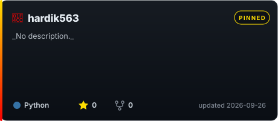</a>
</div>

</details>

<details>
<summary align="center"><b>🌐 Backend / API</b> <sub>· 3</sub></summary>

<p align="center"><sub><i>Django / DRF systems and reference APIs</i></sub></p>

<div align="center">
  <a href="https://github.com/hardik563/CODSOFT">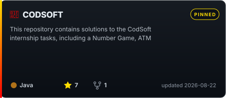</a>
  <a href="https://github.com/hardik563/DSA-ROAD-TO-PLACEMENT-">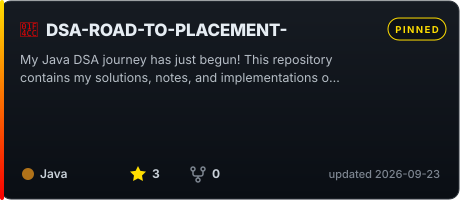</a>
</div>
<div align="center">
  <a href="https://github.com/hardik563/WEB_DEVELOPMENT_ASSIGNMENT">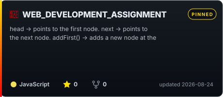</a>
</div>

</details>

<details>
<summary align="center"><b>🎨 Frontend / UI</b> <sub>· 6</sub></summary>

<p align="center"><sub><i>Vue, Nuxt, and design-forward web apps</i></sub></p>

<div align="center">
  <a href="https://github.com/hardik563/PORTFOLIO-PROJECT">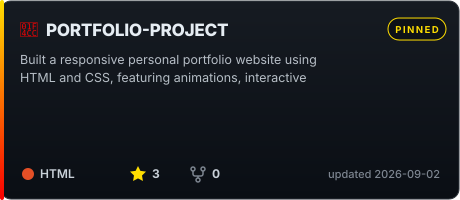</a>
  <a href="https://github.com/hardik563/RAZORPAY-CLONE--FRONTEND-PROJECT">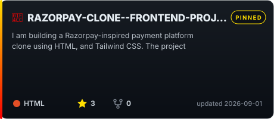</a>
</div>
<div align="center">
  <a href="https://github.com/hardik563/TAILWIND-WEB-DEVELOPMENT-JOURNEY">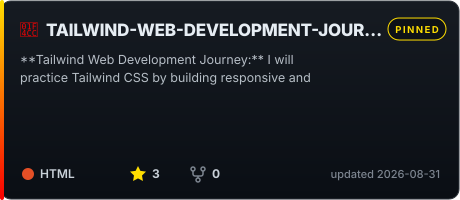</a>
  <a href="https://github.com/hardik563/WEB-DEVELOPNMENT-AND-PROJECT">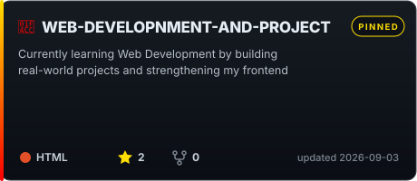</a>
</div>
<div align="center">
  <a href="https://github.com/hardik563/BAVORA">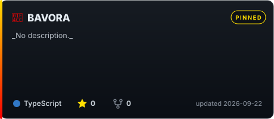</a>
  <a href="https://github.com/hardik563/CALLIVO">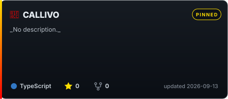</a>
</div>

</details>
<!-- PINNED_REPOS:END -->

<!-- DEVELOPER PROFILES -->
<div align="center">
  
  <a href="https://github.com/hardik563">
    
  </a>
  
</div>

<h2 id="profiles" align="center">🔗 Developer Profiles</h2>

<p align="center">
  <a href="https://leetcode.com/u/hardikdhamija_/">
    
  </a>
  <a href="https://codolio.com/profile/hardikdhamija">
    
  </a>
  <a href="https://www.linkedin.com/in/hardik-dhamija-35932228b/">
    
  </a>
  <a href="https://github.com/hardik563">
    
  </a>
</p>

<!-- CONTRIBUTION GRAPH -->
<div align="center">
  
  <a href="https://github.com/hardik563">
    
  </a>
  
</div>

<h2 id="contributions" align="center">🐍 Contribution Graph</h2>

<!-- SNAKE_GRID:START -->
<table align="center" width="100%"><tr><td colspan="3" align="center">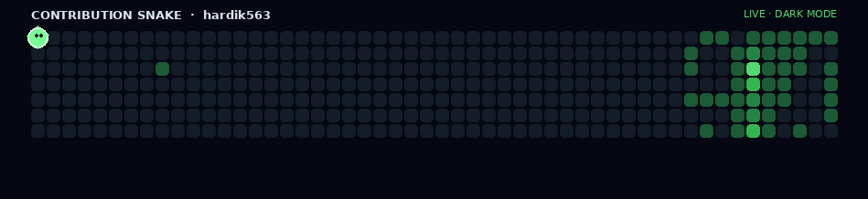<p><b>2026 <sub>(live · rolling 365 days)</sub></b></p></td></tr><tr><td width="33%" align="center"><a href="https://github.com/hardik563?tab=overview&from=2023-01-01&to=2023-12-31">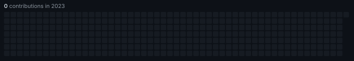</a><p><b>2023</b></p></td><td width="33%" align="center"><a href="https://github.com/hardik563?tab=overview&from=2024-01-01&to=2024-12-31">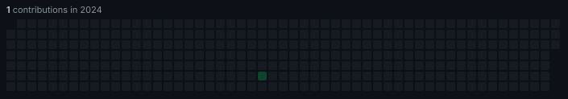</a><p><b>2024</b></p></td><td width="33%" align="center"><a href="https://github.com/hardik563?tab=overview&from=2025-01-01&to=2025-12-31">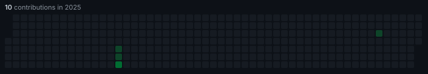</a><p><b>2025</b></p></td></tr></table>
<!-- SNAKE_GRID:END -->

<h3 align="center">🐲 Contribution Dragon</h3>
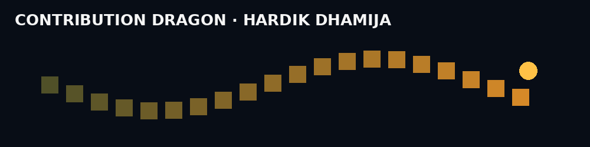

<h3 align="center">🎨 3D Animated Profile</h3>

<!-- 3D_GRID:START -->
<table align="center" width="100%"><tr><td colspan="3" align="center"><a href="./profile-3d-contrib/2026/profile-night-rainbow.svg"></a><p><b>2026 <sub>(live)</sub></b></p></td></tr><tr><td width="33%" align="center"><a href="./profile-3d-contrib/2023/profile-night-rainbow.svg">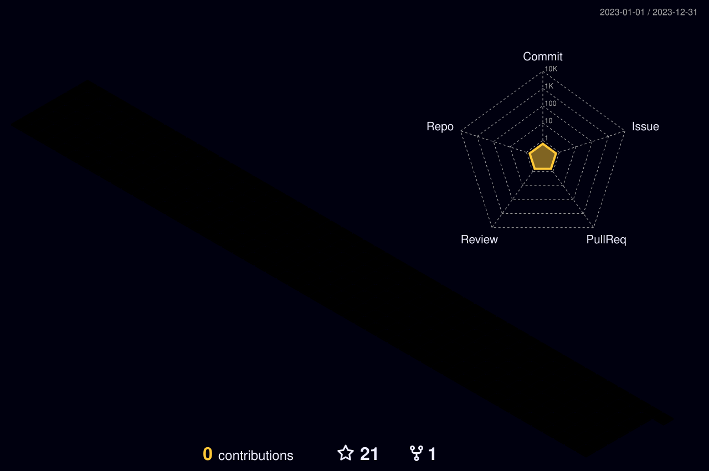</a><p><b>2023</b></p></td><td width="33%" align="center"><a href="./profile-3d-contrib/2024/profile-night-rainbow.svg">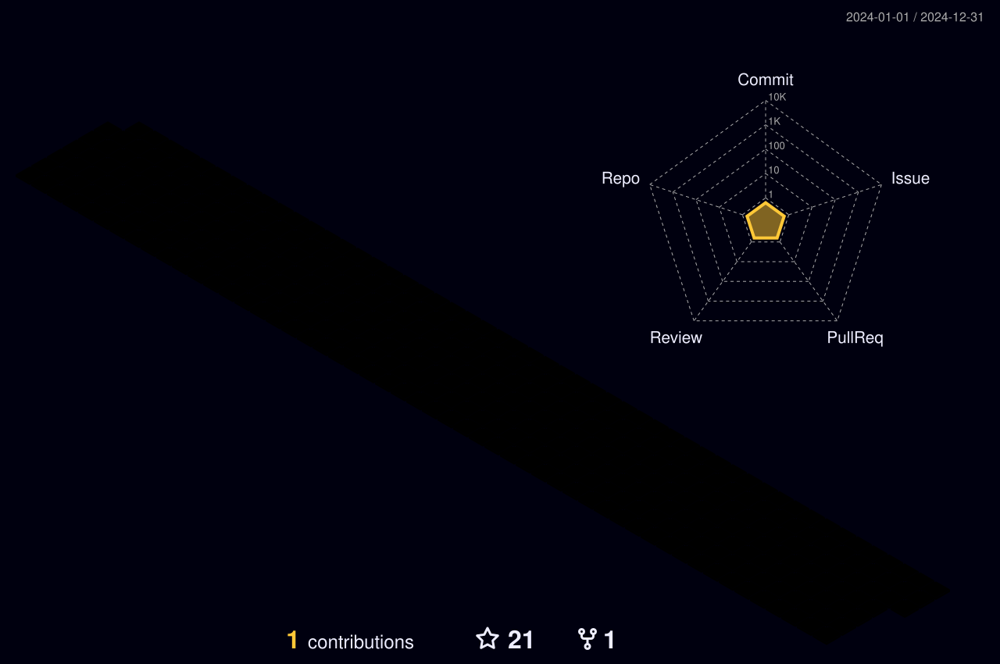</a><p><b>2024</b></p></td><td width="33%" align="center"><a href="./profile-3d-contrib/2025/profile-night-rainbow.svg">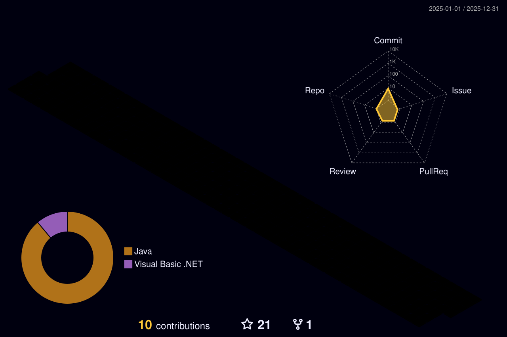</a><p><b>2025</b></p></td></tr></table>
<!-- 3D_GRID:END -->

<details>
<summary align="center"><b>More 3D styles</b> — night-view, gitblock, season-animate, south-season</summary>

<br/>

<p align="center"><i>These additional self-hosted styles are generated together with the main 3D profile by <b>Profile Refresh</b>.</i></p>

<p align="center">
  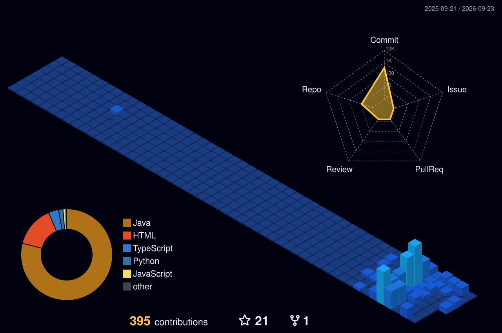
</p>

<p align="center">
  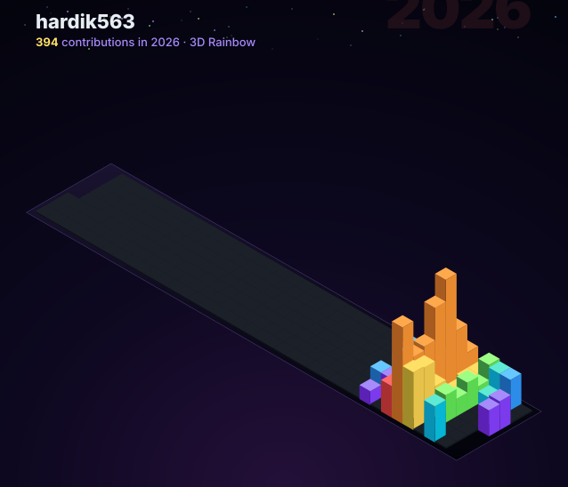
</p>

<p align="center">
  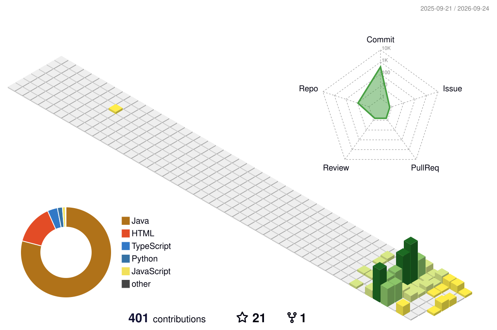
</p>

<p align="center">
  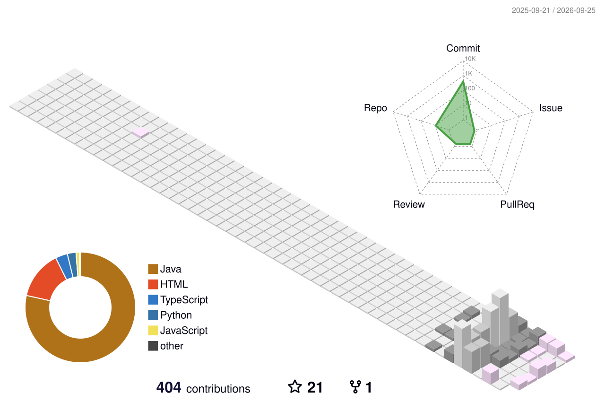
</p>

</details>

<h3 align="center">🌆 GitHub Skylines</h3>

<!-- SKYLINE_GRID:START -->
<table align="center" width="100%"><tr><td colspan="3" align="center"><a href="https://github.com/hardik563/hardik563/blob/main/assets/skyline-2026.svg"></a><p><b>2026 <sub>(live)</sub></b></p></td></tr><tr><td width="33%" align="center"><a href="https://github.com/hardik563/hardik563/blob/main/assets/skyline-2023.svg"></a><p><b>2023</b></p></td><td width="33%" align="center"><a href="https://github.com/hardik563/hardik563/blob/main/assets/skyline-2024.svg"></a><p><b>2024</b></p></td><td width="33%" align="center"><a href="https://github.com/hardik563/hardik563/blob/main/assets/skyline-2025.svg"></a><p><b>2025</b></p></td></tr></table>
<!-- SKYLINE_GRID:END -->

<!-- STL_LINKS:START -->
<p align="center"><b>📐 Open contribution skyline:</b> <a href="https://github.com/hardik563/hardik563/blob/main/assets/skyline-2023.svg">2023 skyline</a> · <a href="https://github.com/hardik563/hardik563/blob/main/assets/skyline-2024.svg">2024 skyline</a> · <a href="https://github.com/hardik563/hardik563/blob/main/assets/skyline-2025.svg">2025 skyline</a> · <a href="https://github.com/hardik563/hardik563/blob/main/assets/skyline-2026.svg">2026 skyline <sub>(live)</sub></a></p>
<!-- STL_LINKS:END -->

<h3 align="center">🏙️ GitHub Cities</h3>

<!-- CITY_GRID:START -->
<table align="center" width="100%"><tr><td colspan="3" align="center"><a href="https://github.com/hardik563?tab=overview&from=2026-01-01&to=2026-12-31"></a><p><b>2026 <sub>(live)</sub></b></p></td></tr><tr><td width="33%" align="center"><a href="https://github.com/hardik563?tab=overview&from=2023-01-01&to=2023-12-31"></a><p><b>2023</b></p></td><td width="33%" align="center"><a href="https://github.com/hardik563?tab=overview&from=2024-01-01&to=2024-12-31"></a><p><b>2024</b></p></td><td width="33%" align="center"><a href="https://github.com/hardik563?tab=overview&from=2025-01-01&to=2025-12-31"></a><p><b>2025</b></p></td></tr></table>
<!-- CITY_GRID:END -->

<!-- GITCITY_LINKS:START -->
<p align="center"><b>🏙️ Open contribution city:</b> <a href="https://github.com/hardik563/hardik563/blob/main/assets/city-2023.svg">2023 city</a> · <a href="https://github.com/hardik563/hardik563/blob/main/assets/city-2024.svg">2024 city</a> · <a href="https://github.com/hardik563/hardik563/blob/main/assets/city-2025.svg">2025 city</a> · <a href="https://github.com/hardik563/hardik563/blob/main/assets/city-2026.svg">2026 city <sub>(live)</sub></a></p>
<!-- GITCITY_LINKS:END -->

<h3 align="center">📍 Lucknow · 3D City</h3>
<p align="center"><sub>My home city — Lucknow, Uttar Pradesh, India.</sub></p>
<<<<<<< HEAD
<p align="center"><a href="https://hardik563.github.io/hardik563/"></a></p>
<p align="center"><em>Interactive real-time 3D Lucknow: drag to rotate, wheel to zoom, right-drag to pan, with animated traffic, lights, landmarks and day/night motion.</em></p>
=======
<p align="center">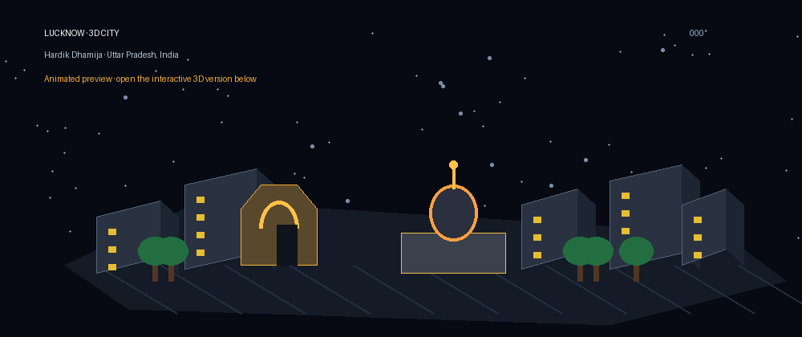</p>
<p align="center"><a href="https://hardik563.github.io/hardik563/"></a></p>
<p align="center"><em>Drag, rotate, zoom and pan the interactive Lucknow city. The README preview above is animated; the button opens the real 3D version.</em></p>
>>>>>>> aab107707075b9657f3ccafb804bb7547c8260e0

<!-- CONNECT WITH ME -->
<div align="center">
  
  <a href="https://github.com/hardik563">
    
  </a>
  
</div>

<h2 id="connect" align="center">🌍 Connect With Me</h2>

<p align="center">
  <a href="https://www.linkedin.com/in/hardik-dhamija-35932228b/" aria-label="LinkedIn"></a>
  <a href="https://leetcode.com/u/hardikdhamija_/" aria-label="LeetCode"></a>
  <a href="https://codolio.com/profile/hardikdhamija" aria-label="Codolio"></a>
  <a href="https://github.com/hardik563" aria-label="GitHub"></a>
</p>

<!-- 📝 GUESTBOOK — visitors leave a message via a pre-filled issue template -->
<div align="center">
  
</div>

<h2 id="guestbook" align="center">📝 Guestbook</h2>

<p align="center">
  Drop a hello, share something cool you're building, or just say hi! 👋<br/>
  Each entry opens a public issue on this repo (it's how the guestbook stays open and visible).
</p>

<p align="center">
  <a href="https://github.com/hardik563/hardik563/issues/new?template=guestbook.yml">
    
  </a>
  &nbsp;
  <a href="https://github.com/hardik563/hardik563/issues?q=label%3Aguestbook">
    
  </a>
</p>

<!-- SUPPORT -->
<div align="center">
  
  <a href="https://github.com/hardik563">
    
  </a>
  
</div>

<h2 id="support" align="center">☕ Support My Work</h2>

<p align="center">If you find my projects helpful, feel free to connect, collaborate, or explore my work:</p>

<p align="center"><i>AI/ML · Deep Learning · Full-Stack Development · Java · DSA · Software Engineering</i></p>

<p align="center"><em>Let’s build practical software and AI-powered solutions together!</em></p>

<!-- ============================================================ -->
<!-- 🎬 ANIMATED FOOTER -->
<!-- ============================================================ -->

<!-- dark animated snake is generated automatically by Profile Refresh -->
<div align="center">

[⬆ back to top](#about)

</div>

<a href="#about">
  
</a>
